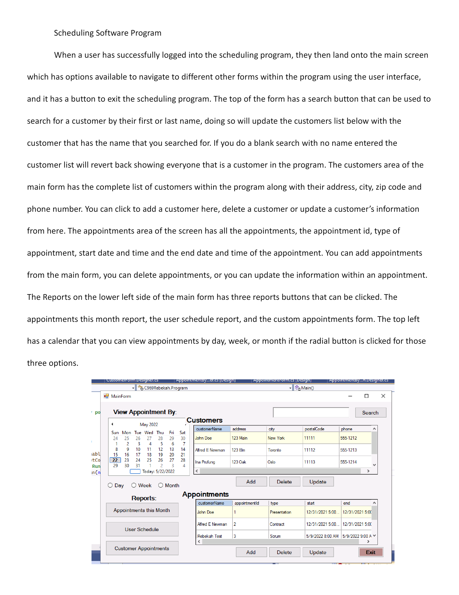

# Capstone Project

• the business problem or opportunity you are solving for, including a description of the customers and why this application will fulfill their needs

• existing gaps in the software application you are replacing or modifying (if applicable)

• the software development life cycle methodology you use to guide and support software development activities

• deliverables associated with the applied software development life cycle methodology

• the plan for implementation of your software solution, including the anticipated outcomes from this development

• the methods for validating and verifying that the developed software application meets the requirements and subsequently the needs of the customers

• the programming environments and any related costs, as well as the human resources that are necessary to execute each task in the development of the software application

• a projected timeline including milestones, start and end dates, duration for each milestone, dependencies, and resources assigned to each task

B. Design and develop a fully functional software application that addresses your identified business problem or organizational need. Include each of the following attributes as they are the minimum required elements for the application:

• one of the following application types: mobile, web, or stand-alone application

• code including inheritance, polymorphism, and encapsulation

• search functionality with multiple row results and displays

• a database component with the functionality to securely add, modify, and delete the data

• ability to generate reports with multiple columns, multiple rows, date-time stamp, and title

• exception controls

• validation functionality

• industry appropriate security features

• design elements that make the application scalable

• a user-friendly, functional GUI

C. Create each of the following forms of documentation for the application you have developed:

• a design document including a class diagram and design diagram

• a test plan for a unit test, including screenshots

• the results of the unit test based on the provided test plan, including screenshots

• source code and executable file

• link to where web app is hosted with HTML code (if applicable)

• user guide for setting up and running the application for maintenance purposes

• user guide for running the application from a user perspective

D. Acknowledge sources, using in-text citations and references, for content that is quoted, paraphrased, or summarized.

